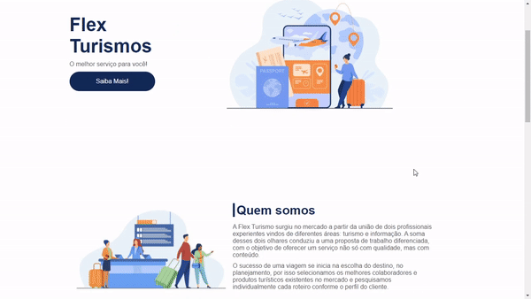

<h1 align="center">
   Flex Turismos
</h1>

  <a href="#-tecnologias">Tecnologias</a>&nbsp;&nbsp;&nbsp;|&nbsp;&nbsp;&nbsp;
  <a href="#-projeto">Projeto</a>&nbsp;&nbsp;&nbsp;|&nbsp;&nbsp;&nbsp;
  <a href="#-layout">Layout</a>&nbsp;&nbsp;&nbsp;|&nbsp;&nbsp;&nbsp;
  <a href="#memo-licença">Licença</a>

## 🚀 Tecnologias

Esse projeto foi desenvolvido com as seguintes tecnologias:

- HTML
- CSS Flexbox
- Responsividade

## 💻 Projeto

O Flex Turismo é uma aplicação com responsividade e CSS Flexbox um desafio da organização DIO digital innovation one utilizando conhecimento e melhores praticas para o mercado.

- HomePage - Página inicial do site
- Navigation Bar - Barra de navegação
- Responsive Page - Site responsivo

Você pode visualizar o layout do projeto  
<h1 align="center">
    
</h1>

## :memo: Licença

Esse projeto está sob a licença MIT. Veja o arquivo [LICENSE](LICENSE.md) para mais detalhes.

---

---

Made with 💜 by Felipe Vicente👋
  

- ## My LinkedIn -  
